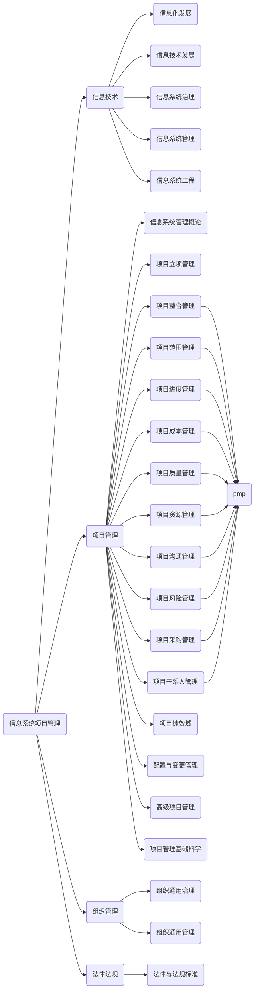
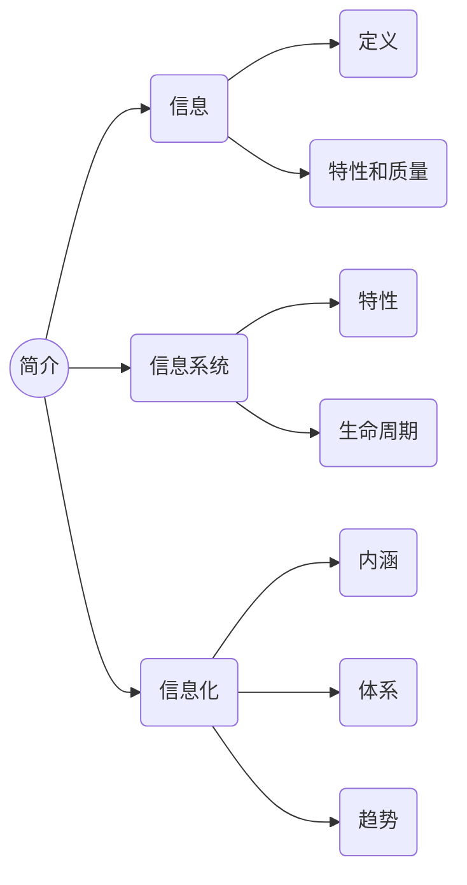

# 信息系统项目管理

## [信息化发展](信息化发展)

### 信息与信息化
#### 信息
    定义：
    特性和质量：
#### 信息系统
    特性:
    生命周期:
#### 信息化
    内涵:
    体系:
    趋势:
#### 现代化基础建设
    

## [信息技术发展](信息技术发展)
## [信息系统治理](信息系统治理)
## [信息系统管理](信息系统管理)
## [信息系统工程](信息系统工程)

## [信息系统管理概论](信息系统管理概论)
## [项目立项管理](项目立项管理)

## [项目整合管理](项目整合管理)
## [项目范围管理](项目范围管理)
## [项目成本管理](项目成本管理)
## [项目质量管理](项目质量管理)
## [项目资源管理](项目资源管理)
## [项目沟通管理](项目沟通管理)
## [项目风险管理](项目风险管理)
## [项目采购管理](项目采购管理)
## [项目干系人管理](项目干系人管理)
## [项目绩效域](项目绩效域)
## [配置与变更管理](配置与变更管理)
## [高级项目管理](高级项目管理)
## [项目管理基础科学](项目管理基础科学)

## [组织通用治理](组织通用治理)
## [组织通用管理](组织通用管理)
## [法律与法规标准](法律与法规标准)