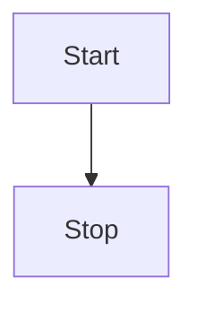

# 信息化
## 信息系统

## 新型基础设施建设
    1、信息基础设施 2、融合基础设置 3、创新基础设施
## 工业互联网
### 平台体系
    1、网络基础 2、平台中枢 3、数据要素 4、安全保障
### 融合应用
    1、平台化设计 2、智能化制造 3、网络化协同 4、个性化定制 5、服务化延申 6、数字化管理
## 车联网（LOV）
### 体系
    端 管 云 三层体系
### 链接方式

# 现代化创新发展

# 数字中国
  
## 数字经济 
    数字经济是继农业经济、工业经济之后的更高级经济形态。从本质上看，数字经济是一种
新的技术经济范式，它建立在信息与通信技术的重大突破的基础上，以数字技术与实体经济融
合驱动的产业梯次转型和经济创新发展的主引擎，在基础没施、生产要素、产业结构和治理结
构上表现出与农业经济、工业经济显著不同的新特点 。

